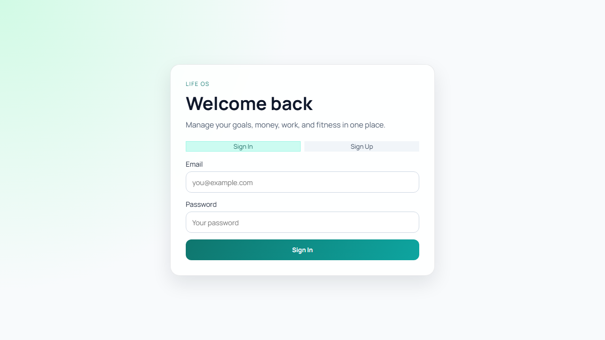
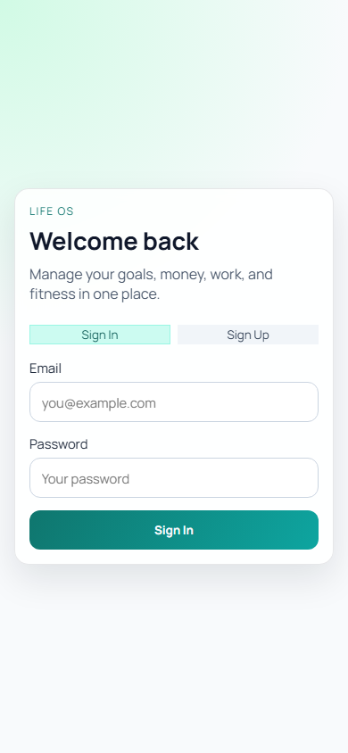

# Life OS

Life OS is a full-stack productivity platform built to run your daily execution in one place. It combines personal operations (tasks, goals, fitness, finance) with lightweight CRM (clients, contacts, deals) and wraps everything in analytics + gamification so progress is measurable, visible, and motivating.

At a high level, the app is a React single-page application powered by Supabase for authentication, storage, and business data. Every module is connected: for example, moving a deal to `won` can automatically generate income in the finance tracker through database triggers.

## Screenshots

### Desktop View



### Mobile View



## What The App Includes

### Command Center Dashboard

- Live widgets for today's agenda, daily training, and 7-day spending
- User progression indicators (XP, level, streak)
- Quick links into every operational module

### Tasks System

- Kanban-style flow (`todo`, `doing`, `done`)
- Priority and due-date management with rich filtering
- XP rewards when tasks are completed (priority-weighted)

### Goals System

- Goal creation by horizon and target date
- Milestone tracking with ordering + completion toggles
- Circular and linear progress indicators derived from milestone completion

### Fitness System

- Workout sessions with exercise library and set logging
- Per-set fields: reps, weight, RPE, warmup
- Progression analytics chart for key exercise weight trends over time

### Finance System

- Accounts, categories, and transaction ledger
- Filtered transaction views (type/account/month)
- Monthly income vs expense chart + net-worth style ticker

### CRM (Clients + Deals)

- Client directory and client detail views
- Client fields include name, phone, city, industry, status, notes
- Contacts and deal notes linked to each client
- Deals pipeline with drag-and-drop Kanban stages
- Mobile quick-add modals for lead/deal entry
- Won-deal revenue auto-synced into finance transactions

### Gamification Layer

- XP total and level tracking per user
- Daily streak calculation from completed activity (tasks/workouts/transactions)
- Global level-up modal when XP crosses threshold

## Visualization Coverage

- Fitness progression: line chart of weight progression for top exercises
- Finance analytics: bar chart for monthly income vs expenses
- Goal analytics: dynamic circular completion indicators
- Dashboard snapshots: live operational widgets (agenda/training/spending)

## Product Behavior

- New users are routed through profile onboarding before app access
- All key tables use row-level security (RLS) for per-user data isolation
- Deal stage changes can trigger finance side effects (won deal -> income transaction)
- Dashboard and analytics values are computed from live Supabase data

## Tech Stack

- Frontend runtime: React 19 + React DOM
- Routing: React Router 7
- Build tooling: Vite 7 + ESLint 9
- Backend platform: Supabase
  - Auth for session management
  - Postgres for application data
  - RLS policies for secure multi-user access
- UI interactions: dnd-kit (drag/drop Kanban)
- Data visualization: Recharts
- Validation/forms libs present: zod, react-hook-form
- Styling approach: custom CSS with responsive breakpoints and module-specific layouts

## Repository Structure

- `life-os/` - React application source
  - `src/pages/` module pages (Tasks, Goals, Fitness, Finance, Clients, Deals)
  - `src/context/` auth/session context
  - `src/lib/` Supabase and gamification helpers
- `supabase/` - SQL migration scripts and schema reference
- `README.md` - root documentation
- `vercel.json` - SPA deploy rewrite/config

## Local Setup

1. Install dependencies:

```bash
npm install --prefix life-os
```

2. Configure env variables in `life-os/.env`:

```env
VITE_SUPABASE_URL=...
VITE_SUPABASE_PUBLISHABLE_KEY=...
```

3. Start development server:

```bash
npm run dev --prefix life-os
```

4. Build for production:

```bash
npm run build --prefix life-os
```

## Supabase SQL Migration Order

Run these scripts in order from the root `supabase/` folder:

1. `001_auth_profile_setup.sql`
2. `002_tasks_rls.sql`
3. `003_fitness_rls.sql`
4. `004_fitness_select_options.sql`
5. `005_goals_milestones_rls.sql`
6. `006_milestone_ordering.sql`
7. `007_goal_auto_status.sql`
8. `008_finance_rls.sql`
9. `009_crm_rls.sql`
10. `010_gamification.sql`
11. `011_deals_won_to_finance.sql`
12. `012_clients_phone_city.sql`
13. `013_deals_won_sync_fix.sql`

## Deployment

The project is configured for Vercel from repo root (`vercel.json`) with SPA rewrite support.

Required env vars in Vercel:

- `VITE_SUPABASE_URL`
- `VITE_SUPABASE_PUBLISHABLE_KEY`
