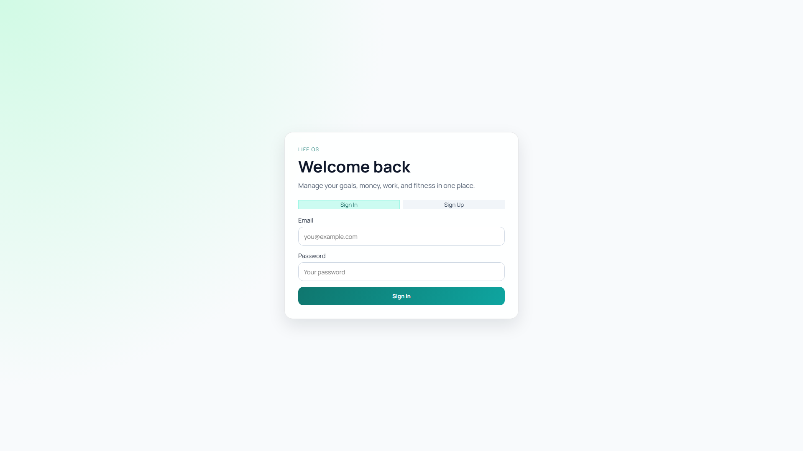

# Life OS

Life OS is a full-stack productivity and personal operations platform that helps you manage work, health, money, and client pipeline in one app.

The goal is simple: convert daily actions into measurable progress using live dashboards, analytics, and gamification.

## App Preview

### Desktop




### Mobile


## What Life OS Does

- Centralizes daily execution across tasks, goals, fitness, finance, and CRM
- Provides a Command Center dashboard with live operational widgets
- Tracks productivity through focus sessions, completion rates, and streak metrics
- Rewards consistency with XP, levels, and level-up milestones

## Main Product Modules

### 1) Command Center

- Today's agenda (todo tasks due today)
- Daily training snapshot (today's workout or action prompt)
- 7-day finance snapshot
- Focus metrics (today's deep-work minutes and blocks)

### 2) Task Management + Focus Engine

- Task lifecycle: `todo`, `doing`, `done`
- Priority and due-date planning
- Weekly task analytics:
  - created vs completed trend
  - completion-rate trend
  - best-performing week insight
- Focus system:
  - Pomodoro mode and manual mode
  - start/pause/resume/complete/cancel
  - per-task focus accumulation
  - session history page with filters and summaries
- Browser notifications + sound cues for timer transitions

### 3) Goals

- Goals with milestone breakdown
- Milestone ordering and completion tracking
- Dynamic progress indicators (linear + circular)

### 4) Fitness

- Workout logging with exercise library
- Set tracking (reps, weight, RPE, warmup)
- Progression analytics (weight trend over time)

### 5) Finance

- Accounts, categories, transactions
- Monthly income vs expense analytics
- Net-worth style summary ticker

### 6) CRM (Clients + Deals)

- Client directory + detail pages
- Client fields include phone and city
- Deal Kanban pipeline (`lead`, `contacted`, `proposal`, `won`, `lost`)
- Mobile quick-add for leads and deals
- Won deal amounts auto-synced into finance transactions

### 7) Gamification

- XP from task completion and completed focus blocks
- Level thresholds + global level-up modal
- Daily streak calculation from meaningful activity

## Tech Stack

- Frontend: React 19, React DOM
- Routing: React Router 7
- Build Tooling: Vite 7, ESLint 9
- Backend: Supabase
  - Auth
  - Postgres
  - Row Level Security (RLS)
- Drag-and-drop: dnd-kit
- Data visualization: Recharts
- Validation/forms libs: zod, react-hook-form
- Styling: custom responsive CSS

## Architecture Notes

- Single-page React app in `life-os/`
- SQL-first backend evolution in `supabase/` migrations
- Security enforced at DB level with RLS policies
- Feature data connected across modules (for example, won deals -> finance income)

## Repository Structure

- `life-os/` - Vite React application
  - `src/pages/` - product modules and screens
  - `src/context/` - auth/session provider
  - `src/lib/` - shared utilities (Supabase, gamification, notifications)
- `supabase/` - schema and migration scripts
- `vercel.json` - deployment/rewrite config

## Local Development

1. Install dependencies:

```bash
npm install --prefix life-os
```

2. Add env vars in `life-os/.env`:

```env
VITE_SUPABASE_URL=...
VITE_SUPABASE_PUBLISHABLE_KEY=...
```

3. Run locally:

```bash
npm run dev --prefix life-os
```

4. Production build:

```bash
npm run build --prefix life-os
```

## Supabase Migration Order

Run scripts from `supabase/` in sequence:

1. `001_auth_profile_setup.sql`
2. `002_tasks_rls.sql`
3. `003_fitness_rls.sql`
4. `004_fitness_select_options.sql`
5. `005_goals_milestones_rls.sql`
6. `006_milestone_ordering.sql`
7. `007_goal_auto_status.sql`
8. `008_finance_rls.sql`
9. `009_crm_rls.sql`
10. `010_gamification.sql`
11. `011_deals_won_to_finance.sql`
12. `012_clients_phone_city.sql`
13. `013_deals_won_sync_fix.sql`
14. `014_task_focus.sql`
15. `015_task_focus_pause_status.sql`

## Deployment

Configured for Vercel at repo root with SPA rewrites.

Required environment variables:

- `VITE_SUPABASE_URL`
- `VITE_SUPABASE_PUBLISHABLE_KEY`
